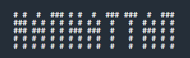

# ASCII Art
## The Goal
In stations and airports you often see this type of screen:

Have you ever asked yourself how it might be possible to simulate this display on a good old terminal? We have: with ASCII art!

## Rules
ASCII art allows you to represent forms by using characters. To be precise, in our case, these forms are words. For example, the word "MANHATTAN" could be displayed as follows in ASCII art:

Your mission is to write a program that can display a line of text in ASCII art in a style you are given as input.

## Game Input

### Input

**Line 1:** the width **L** of a letter represented in ASCII art. All letters are the same width.

**Line 2:** the height **H** of a letter represented in ASCII art. All letters are the same height.

**Line 3:** The line of text **T**, composed of **N** ASCII characters.

**Following lines:** the string of characters ABCDEFGHIJKLMNOPQRSTUVWXYZ? Represented in ASCII art.

### Outpu

The text **T** in ASCII art.

The characters a to z are shown in ASCII art by their equivalent in upper case.

The characters that are not in the intervals [a-z] or [A-Z] will be shown as a question mark in ASCII art.

## Constraints

0 < L < 30

0 < H < 30

0 < N < 200

# Strategy

The auto-generated code helps you by parsing the standard input according to the problem statement. It already has already defined the variables **L**, **H** the text **T**  and depending of the language some lines of code to register "the string of characters ABCDEFGHIJKLMNOPQRSTUVWXYZ? Represented in ASCII art."

In order to solve the puzzle, I decided to create a variable **ASCIIALFA** to save the ASCII alfabet. This variable is a vector of strings that has a size equal to the heighgt of the letters represented in ASCII art. Each element of the vector correspond to one of the strings/lines that forms the ASCII alfabet. Also, i created a string varible **ALFA** which consists of the same characters but represented in regular letters.

The purpose is that I will compare each letter from the **T** text to **ALFA** and obtain the index in where it is. With this value and the width **L** is posible to obtain  the ASCII art representation of the letter by extracting from **ASCIIALFA** the characters that correspond to the letter line by line. If the character in **T** is not in **ALFA** it is substituted by the question mark.
