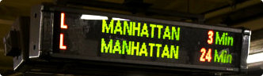

# ASCII Art
## The Goal
In stations and airports you often see this type of screen:

Have you ever asked yourself how it might be possible to simulate this display on a good old terminal? We have: with ASCII art!

## Rules
ASCII art allows you to represent forms by using characters. To be precise, in our case, these forms are words. For example, the word "MANHATTAN" could be displayed as follows in ASCII art:

Your mission is to write a program that can display a line of text in ASCII art in a style you are given as input.

## Game Input

### Input

**Line 1:** the width **L** of a letter represented in ASCII art. All letters are the same width.

**Line 2:** the height **H** of a letter represented in ASCII art. All letters are the same height.

**Line 3:** The line of text **T**, composed of **N** ASCII characters.

**Following lines:** the string of characters ABCDEFGHIJKLMNOPQRSTUVWXYZ? Represented in ASCII art.

### Output

The text **T** in ASCII art.

The characters a to z are shown in ASCII art by their equivalent in upper case.

The characters that are not in the intervals [a-z] or [A-Z] will be shown as a question mark in ASCII art.

## Constraints

0 < L < 30

0 < H < 30

0 < N < 200

# Strategy

The auto-generated code helps you by parsing the standard input according to the problem statement. It already has already defined the variables **L**, **H** the text **T**  and depending of the language some lines of code to register "the string of characters ABCDEFGHIJKLMNOPQRSTUVWXYZ? Represented in ASCII art."

In order to solve the puzzle a variable **ASCIIALFA** was created to save the string of characters (alphabet plus quesiton mark) represented in ASCII art from the input. This variable is a vector of strings that has a size equal to the height of the letters represented in ASCII art. Each element of the vector correspond to one of the strings/lines that forms the ASCII alfabet. Also, a string variable **ALFA** was created which consists of the same string of characters (the alphabet plus the question mark) but represented in normal characters.

The purpose was to compare each character from the **T** text to the **ALFA** variable to obtain the index (**idx**) in where it is located in the **ALFA**. With the value of the index **idx** and the width **L** it was posible to obtain  the ASCII art representation of the character in the text **T** by extracting from **ASCIIALFA** the characters that correspond to the letter line by line. The ASCCI art representation of each character from the text **T** was found fro the **idx*L** position to the **idx*L+L** position in each of the **H** lines of the **ASCIIALFA**. If the character in **T** is not in **ALFA** it is substituted by the question mark.

