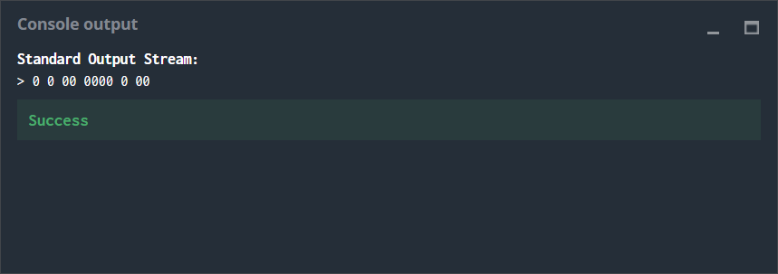

# Chuck Norris
## The Goal
Binary with 0 and 1 is good, but binary with only 0, or almost, is even better! Originally, this is a concept designed by Chuck Norris to send so called unary messages.

Write a program that takes an incoming message as input and displays as output the message encoded using Chuck Norris’ method.

## Rules
Here is the encoding principle:

The input message consists of ASCII characters (7-bit)
The encoded output message consists of blocks of **0**
A block is separated from another block by a space
Two consecutive blocks are used to produce a series of same value bits (only **1** or **0** values):
- First block: it is always **0** or **00**. If it is **0**, then the series contains **1**, if not, it contains **0**
- Second block: the number of **0** in this block is the number of bits in the series
 
## Example
Let’s take a simple example with a message which consists of only one character: Capital C. C in binary is represented as 1000011, so with Chuck Norris’ technique this gives:

**0 0** (the first series consists of only a single **1**)
**00 0000** (the second series consists of four **0**)
**0 00** (the third consists of two **1**)

So C is coded as:**0 0 00 0000 0 00**

 
Second example, we want to encode the message CC (i.e. the 14 bits **10000111000011**) :

**0 0** (one single **1**)
**00 0000 ** (four **0**)
**0 000** (three **1**)
**00 0000** (four **0**)
**0 00** (two **1**)

So CC is coded as: **0 0 00 0000 0 000 00 0000 0 00**

## Game Input

### Input
**Line 1:** the message consisting of N ASCII characters (without carriage return)

### Output
The encoded message

## Constraints
0 < **N** < 100

## Example
**Input**

C

**Output**

0 0 00 0000 0 00

# Strategy

The auto-generated code helps you parse the standard input according to the problem statement. It has already defined the **message** variable as a string and reads it from the input.

To solve the puzzle the process is divided mainly in two steps, first translate the original message to binary and then translate it from binary to *unary*.

**Translation into binary**

The message is first translated character by character to binary using an already built-in method/function and stored in a variable **char_binary**. The length of each character in binary (**char_binary**) must be 7 digits long. If it is not 7 digits long zeros must be added to the begining until it reaches the length of 7 digits. Then each **char_binary** is added one after another to a variable **in_binary** that contains all the message translated to binary.

This is done using a for loop to go through each character of the message (**message**), then translate it into binary (**char_binary**), then use an if statement to verify its length and correct it (add zeros) and finally add the translated character (**char_binary**) to the binary translated message (**in_binary**).

**Translation int *unary***

Before starting the translation to *unary* an if statement if used to verify that the length of **in_binary** is greater than 1. Then a for lopp is used to go through each digit of **in_binary**. Inside the for loop a set of nested if statements are used to perform the operations of translating. The first if statement is a statement for  the particular case of the first digit, this if statement verifies if the digit is the first one in **in_binary**. If true, another if statement is used to compare if the value of the digit is 1. If trtue, the begining of the final message (**answer**) is **0 0**, else if false (this means, if is 0) the begining of **answer** is **00 0**.

An else if statement is used for the rest of the digits in **in_binary**. Inside this statement a set of 4 if statements are used to verifythe values of the digit current digit and the previous digitin **in_binary**. If true  

