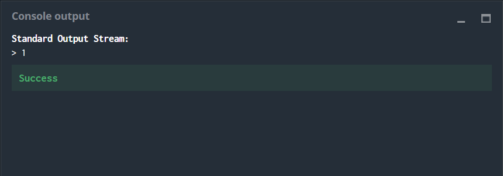

# Horse-Racing Duals

## The Goal

Casablanca’s hippodrome is organizing a new type of horse racing: duals. During a dual, only two horses will participate in the race. In order for the race to be interesting, it is necessary to try to select two horses with similar strength.

Write a program which, using a given number of strengths, identifies the two closest strengths and shows their difference with an integer (≥ 0).

## Game Input

### Input

**Line 1:** Number **N** of horses

**The N following lines:** the strength Pi of each horse. Pi is an integer.

### Output

The difference **D** between the two closest strengths. **D** is an integer greater than or equal to 0.

## Constraints

1 < **N**  < 100000

0 < **Pi** ≤ 10000000

## Example

**Input** 

3
5
8
9

**Output**

1

# Strategy

The auto-generated code helps you parse the standard input according to the problem statement. It has already defined the **N** variable and reads it from the input, then within a for loop it defines the variable **Pi** and reads it from the input one by one.

In order to solve the puzzle it was opted to define an array or a vector (dependinng of the language) named **P** where all the **Pi**s were stored. Then they were all sorted in ascending order through a programmed or an already built-in sorting method/function. Using an if statement the difference between two consecutive numbers **D** was calculated and compared to a **minDif** variable, that was defined and initialized as the maximum popsible value **10000000**. If **D** was inferior to the stored **minDif** the later was updated with a new minumum value equals to **D**. The process was through all the **N** numbers in **P** using the for loop. At the end the **minDif** value was sent as an output.

# Flowchart

