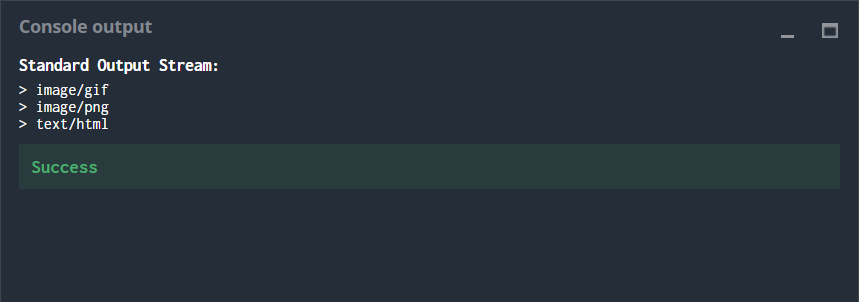

# The Goal
MIME types are used in numerous internet protocols to associate a media type (html, image, video ...) with the content sent. The MIME type is generally inferred from the extension of the file to be sent.

You have to write a program that makes it possible to detect the MIME type of a file based on its name.
## Rules
You are provided with a table which associates MIME types to file extensions. You are also given a list of names of files to be transferred and for each one of these files, you must find the MIME type to be used.

The extension of a file is defined as the substring which follows the last occurrence, if any, of the dot character within the file name.
If the extension for a given file can be found in the association table (case insensitive, e.g. TXT is treated the same way as txt), then print the corresponding MIME type. If it is not possible to find the MIME type corresponding to a file, or if the file doesn’t have an extension, print UNKNOWN.
## Game Input
### Input
Line 1: Number N of elements which make up the association table.

Line 2: Number Q of file names to be analyzed.

**N** following lines: One file extension per line and the corresponding MIME type (separated by a blank space).

**Q** following lines: One file name per line.

### Output
For each of the Q filenames, display on a line the corresponding MIME type. If there is no corresponding type, then display UNKNOWN.

## Constraints

0 < **N** < 10000

0 < **Q** < 10000

File extensions are composed of a maximum of 10 alphanumerical ASCII characters.

MIME types are composed of a maximum 50 alphanumerical and punctuation ASCII characters.

File names are composed of a maximum of 256 alphanumerical ASCII characters and dots (full stops).

There are no spaces in the file names, extensions or MIME types.
## Example

**Input**

3

3

html text/html

png image/png

gif image/gif

animated.gif

portrait.png

index.html

**Output**

image/gif

image/png

text/html

# Strategy

The auto-generated code below aims at helping you parse the standard input according to the problem statement. It starts predefining 5 variables **N**, **Q**, **EXT**, **MT** and **FNAME**. The code has already programmed the reading of the lines from the input, assigning the integer values of **N** and **Q** and then using two for loops one after the other. The first one reading the **N** lines containing the file extensions and the correspondinig MIME type and assigning them to the string variables **EXT** and **MT** respectively, and next for loop reading the **Q** lines containing one file name per line and assiging them to the string variable **FNAME**.

The first thing done was to define a dictionary variable **MIMETYPES** to store the extensions and the corresponding MIMEtype using the first ones (**EXT**) as the keys. The  variables **EXT** and **MT** were stored in just after they were read in the first for loop but changing **EXT** to lowercases in the process. It could be uppercases too, the purpose is to standerize it so it can be compared with later.

In the second for loop a new string variable **EXT2** was defined after the already programmed reading and assigning of the filename **FNAME**. Using an if clause it was checked if there was a point **'.'** present in the file name. If there is no point that means that there is no extension an else statement sends out the output **'UNKNOWN'**. If there is a point it means that there is an extension and the string **FNAME** is splitted in two substrings, assigning the second substring containing the extension name into the variable **EXT2**. The substring is changed to lowercases in the process, and as explained before it could be changed to uppercases too. Inside this first if statement another if statement is used to verify if the extension **EXT2** in the filename **FNAME** is in the association table (dictionary **MIMETYPES**). If the extension is not present an else statement  sends out the output **'UNKNOWN'**. If the extension is in the association table (as a key) the corresponding MIME type is sent to the output. 

