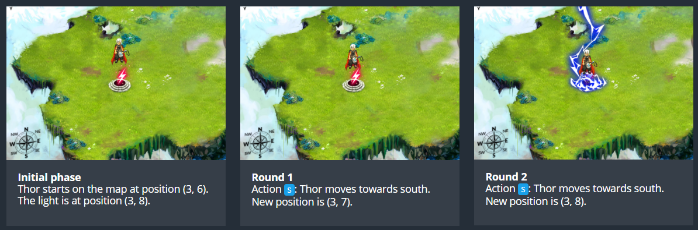
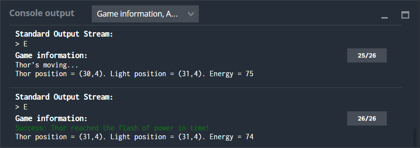

# Power Of Thor - Episode 1
## The Goal
The purpose of the program is to allow Thor to reach the light of power.
## Rules
Thor moves on a map which is **40** wide by **18** high. Note that the coordinates (X and Y) start at the top left! This means the most top left cell has the coordinates "X=0,Y=0" and the most bottom right one has the coordinates "X=39,Y=17".

**Once the program starts** you are given:
the variable **lightX**: the X position of the light of power that Thor must reach.
the variable **lightY**: the Y position of the light of power that Thor must reach.
the variable **initialTX**: the starting X position of Thor.
the variable **initialTY**: the starting Y position of Thor.
**At the end of the game turn**, you must output the direction in which you want Thor to go among: N (North), NE (North-East), E (East), SE (South-East), S (South), SW (South-West), W (West), NW (North-West)

Each movement makes Thor move by 1 cell in the chosen direction.

### Initial phase
Thor starts on the map at position (3, 6). The light is at position (3, 8).
### Round 1
Action **S**: Thor moves towards south.

New position is (3, 7).

### Round 2
Action **S**: Thor moves towards south.

New position is (3, 8).

## Note
Do not forget to execute the tests from the "Test cases" panel.

**Beware:** the tests given and the validators used to compute the score are slightly different in order to avoid hard coded solutions.

## Game Input
The program must first read the initialization data from the standard input, then, in an infinite loop, provides on the standard output the instructions to move Thor.

### Initialization input
**Line 1:** 4 integers **lightX lightY initialTX initialTY**. (lightX, lightY) indicates the position of the light. (initialTX, initialTY) indicates the initial position of Thor.

### Input for a game round
**Line 1:** the number of remaining moves for Thor to reach the light of power: **remainingTurns**. You can ignore this data but you must read it.

### Output for a game round
A **single line** providing the move to be made: **N NE E SE S SW W** or **NW**

## Constraints

0 ≤ **lightX** < 40

0 ≤ **lightY** < 18

0 ≤ **initialTX** < 40

0 ≤ **initialTY** < 18

Response time for a game round ≤ 100ms

# Strategy

The auto-generated code helps you parse the standard input according to the problem statement. It has already defined the variables: **lightX**, **lightY**, **initialTX**, **initialTY** and **remainingTurns** (the one that counts the maximum number of iterations you have to reach the goal). 

First of all, an if statement was used to asure the values of the variables were within the constraints.

Then, in order to solve the puzzle it was opted to calculate the distance from the initial position of Thor to the position of the Light of Power and with this information use if statements to indicate the direction that Thor should take. Two variables **distX** and **distY** were defined, so that they will give information about which direction should Thor take. If **distX** was positive Thor must go East, if negative West. If **distY** was positive Thor must go North, if negative South.

Then, there were the combinations of the values of **distX** and **distY** that gave information if Thor needed to go in diagonal, that is North-East, South-East, South-West or North-West. For example if **distX** an **distY** were both positives that meant that Thor must go North-East (**NE**) and so on.  

The code output for each iteration was a single line providing the move to be made and at the same time the values of the variables **distX** and **distY** were updated by adding (if going North or West) or substracting (if going South of East) 1, that is the number of steps taken. From the auto-generated code the program substracted automatically one to the **remainingTurns** variable. 

The process was repeated inside the while loop sending the correponding text as output until Thor reached the Light of Power, exiting the while loop.

