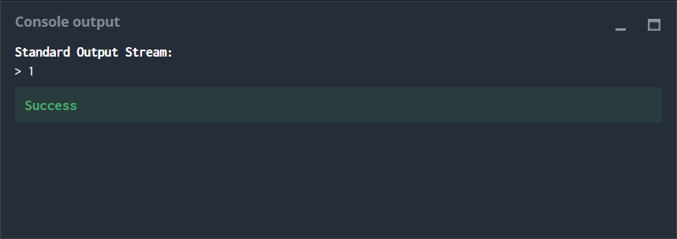
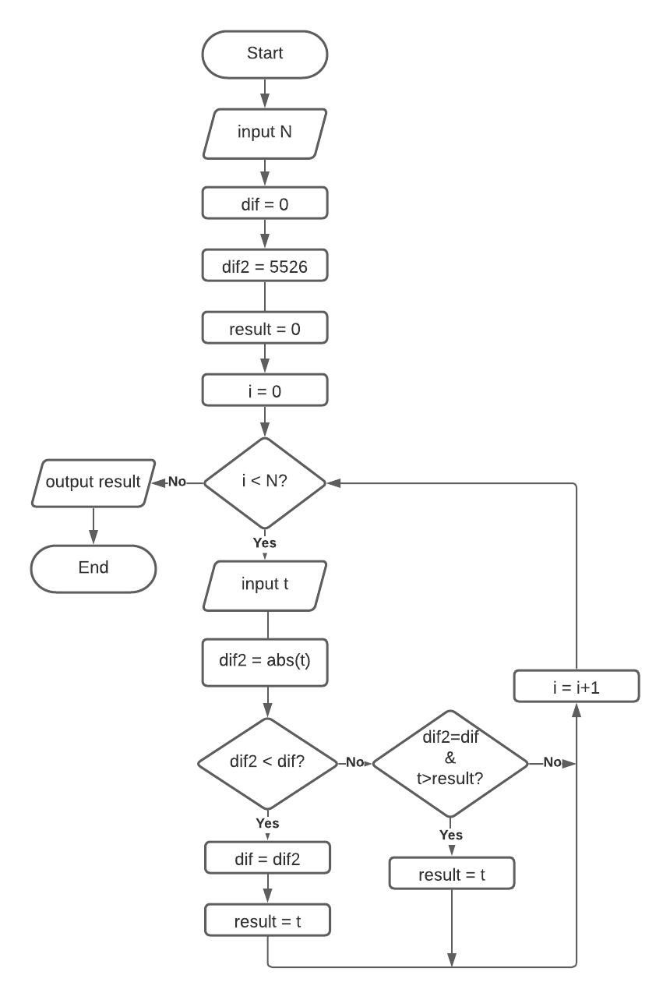

# Temperatures
## The Goal
The purpose is to analyze records of temperature and to find the closest to zero.

**Sample temperatures** Here, -1 is the closest to 0.

##	Rules
You have to write a program which output is the temperature closest to 0 in the input data. If there are two numbers equally close to zero you have to choose the positive integer  closest to zero (example, if the temperatures are -5 and 5, then display 5).
## Game Input
The program have to read the data from the input and write the result on the output.
### Input
**Line 1: N**: number of temperatures to analyze
**Line 2: A string of **N** temperatures as integers (from -273 to 5526)

## #Output
Must display 0 (zero) if the no temperatures are provided (**N** = 0). Otherwise, display the temperature that is closest to 0.
## Constraints
0 ≤ N < 10000

## Example
**Input**

5

1 -2 -8 4 5

**Output**

1

# Strategy

The auto-generated code helps you parse the standard input according to the problem statement. It has already defined the **N** variable and depending of the language has the input data in strings, arrays or vectors to store the input data in a for cycle asaigning each temperature to a **t** variable.

To solve the puzzle it was opted to take each temperature **t** and calculate the difference between the temperature and the reference (zero). For that two variables were used, **dif** and **dif2**. **dif** started as the maximum temperature possible in the range (5526) and **dif2** started as zero (0). An  if statement was used assigning the absolute value of the temperature to **dif2** and then it was compared to **dif**, if **dif2** was inferior to **dif** the lowest difference was stored and the temperature **t** was stored in a variable **result**.

For the case where the difference between two or more temperatures were the same an if statement was used were only the positive temperature **t** was kept.

The comparation process was repeated through all the data set and the **result** was sent as output.

# Flowchart

