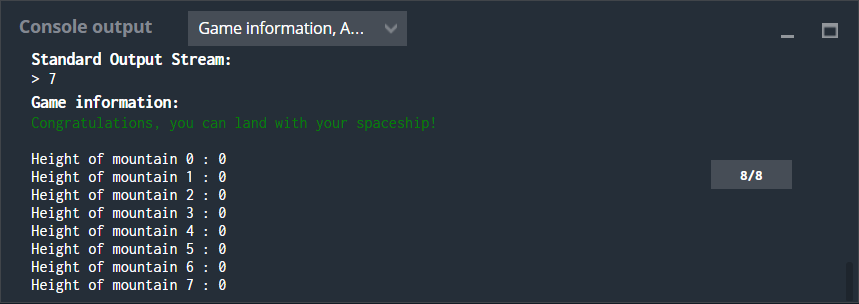
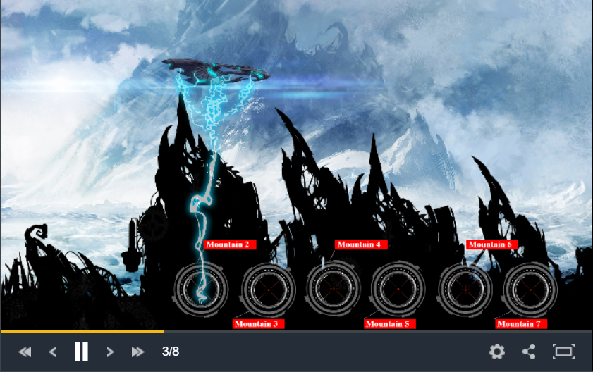

# The Descent
## 	The Goal
The purpose is to avoid colliding the starship with the mountains by destroying them before. So, you have to shoot the highest mountain on your path.
## Rules
For each turn in the start of each game, you will have the height of the 8 mountains from left to right.
On each game turn you have to fire at the highest mountain by giving as output its index (from 0 to 7).

When you fire a mountain it will only destroy a part of it, and will reduce its height. The ship will descend after each pass.  

## Game Input
Uisng an infinite loop you have to read the heights of the mountains from the input and print to the output the index of the mountain you want to shoot.
### Input for one game turn
8 lines: one integer **mountainH** per each line. Each one represents the height of one mountain expressed in the order of their index (from 0 to 7).
### Output for one game turn
Must be a single line with only one integer number that represents the index of the mountain you want to shoot.
## Constraints

0 ≤ mountainH ≤ 9

Response time per turn ≤ 100ms

# Strategy

The auto-generated code helps you parse the standard input according to the problem statement. It places a while loop representing the game where each iteration is a turn of the game. Where you are given inputsmax (**mountainH** the height of the mountain) and where you have to print an output (the index of the mountain to fire on). The inputs are given automatically (stored in strings, arrays or vectors depending of the language) within a for loop updated according to your last actions.

In order to solve the puzzle an if statement was used to compare each mountain's height **mountainH** in each iteration of the loop and select the highest one. For that two variables were created, **max** (the height of the highest mountain) and **imax** (the index of the highest mountain). Both variables were initialized as zero. From the first iteration in the for loop the if statement compared if **mountainH** was greater than the value of **max**. If true, the value of **mountainH** was asigned to **max** and the index of it was stored in **imax**.    

The process of comparation was repeated through all the data set and **imax** was sent as output.

